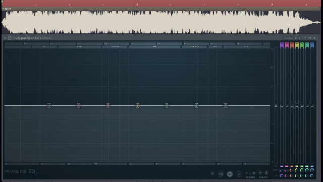
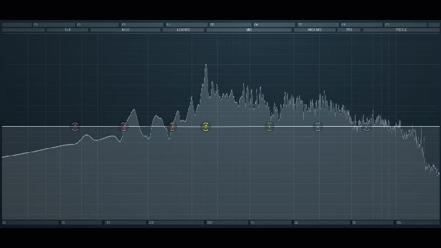

# ductf22-misc-rage
DownUnderCTF 2022 - misc/rage writeup

## Official write up from their Github: [LINK](https://github.com/DownUnderCTF/Challenges_2022_Public/tree/main/misc/rage)


Literally just a goofy ahh boy found out something in a goofy ahh sound ngl.

So here it is, my write up after solving this `easy level CTF`.


* **I used FL STUDIO, a software for making music, sound designing.**
(Yes, I am a music producer)

## Contents

The `RAGE!.wav` file first look:


* **What we can see here**
    - Nothing, I'm sorry.

* **What we can hear from it**
    - The hell was that cuh.
    - It's actually the goofiest song I've ever heard.



* **After playing with my ears like I used to do with myself, I heard something that kinda odd, I found out something:**
    - they actually bad at music producing.
    - Did you see that `high dynamic in the middle`?




*We found out this frequency `around 500hz` is louder than normal.*


* **So i just separated it and exported an audio file that it only has frequencies around 500hz.**
    - You can check that exported audio file right [here](https://github.com/dathtd119/ductf22-misc-rage/blob/main/exported.mp3)
    - The exported file is supposed to sound uglier like the origin one but I love my and your ears so yeah, *prettify* it.


*BRUH THESE ARE MORSE CODE NGL.*

## Final result
* After searching for morse code, I can finally capture the flag.

```
.-. .- --. .. -. --. - --- .-- .  .. .-. -.. .-.. .. -... .. -.. ---
 R  A   G  I  N   G  T  O   W  E  I   R   D   L   I   B   I   D   O
```

## Thanks for reading.

*Just a little flag to the bigger flag.*


